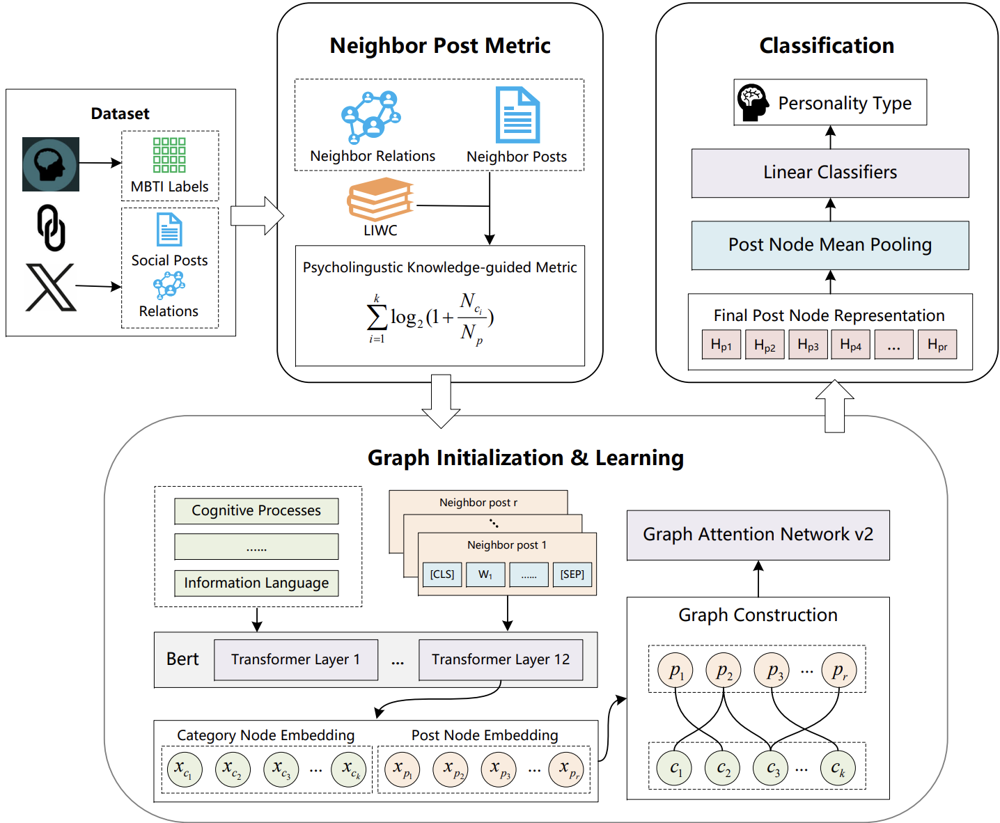

# Readme

## Introduction

The processed dataset & Code for the paper *Psycholinguistic Knowledge-guided Graph Network for Personality Detection of Silent Users*.



Python requirements:

```python
emoji~=1.6.3
numpy~=1.21.5
pandas~=1.3.5
tqdm~=4.64.1
transformers~=4.11.3
torch~=1.10.2
scikit-learn~=1.0.2
tensorboardX~=2.2
gensim~=4.0.1
torch-geometric ~=2.0.4
```

The processed dataset is in `\neighbor_graph`, which includes the top-20 high-influence neighbor user posts, psychological-relevant categories & edges between posts and categories. The processed dataset is the `dict` structure:

```python
{
    "features": List[List[str]], # first 18 categories + max 200 neighbor user posts
    "labels": str,	# MBTI label from personality-database
    "edges": List[List[int]]	# edges between category nodes and post nodes
}
```

## Usage

1. Install the required packages.
2. Download the BERT pretrained parameter file `pytorch_model.bin` from [Huggingface](https://huggingface.co/google-bert/bert-base-uncased) ([HF-Mirror](https://hf-mirror.com/models?search=bert-base-uncased)), and put the file into the directory `bert-base-uncased`.

2. Run the python file `main.py` to train & test the model:

> python ./main.py

3. The result is saved in the directory `./result`.

## Ethical Concerns

> Personality detection is an ethically sensitive task aimed at the people themselves. Our study aims to develop a technical method for silent user research instead of creating a privacy-invading tool. To ensure the privacy of crawled users, we worked within the purview of acceptable privacy practices and strictly followed the Twitter and Personality Database data usage policies. The dataset used in our research is from public sources, and all user information is anonymized. Moreover, any research or application based on our study is only allowed for research purposes to avoid the misuse and abuse of our work for causing real-world threats.